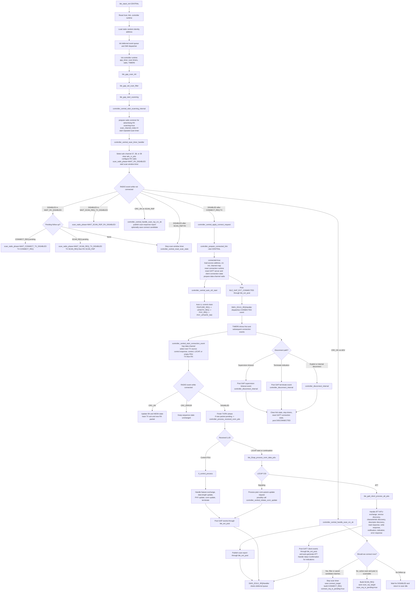
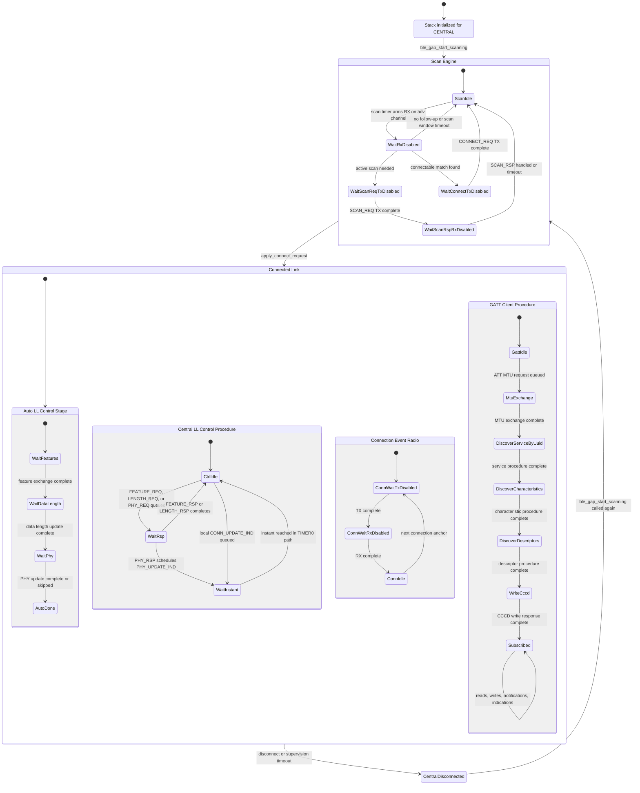
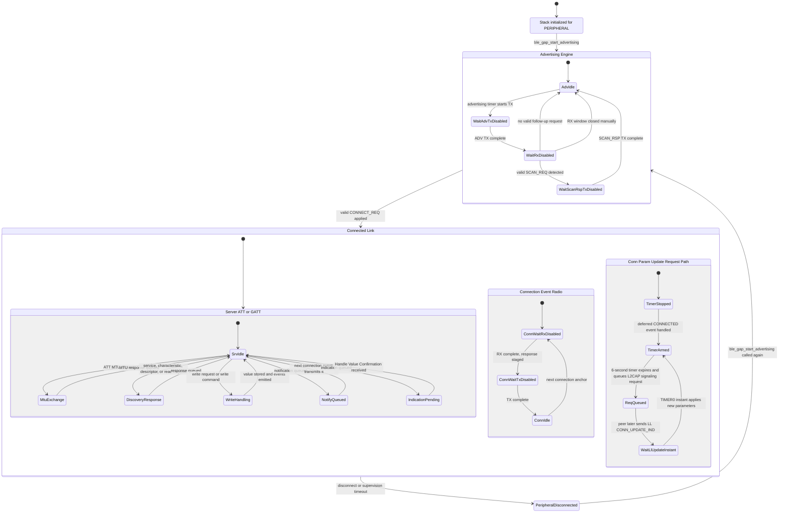

<!-- SPDX-License-Identifier: MIT -->

# BLE Stack Flowcharts

This document describes the internal working flow of the stack itself:

- bootstrap and runtime dispatch
- GAP host entry points
- controller radio phases
- connected link scheduling
- L2CAP routing
- ATT and GATT client flow for central
- ATT and GATT server flow for peripheral
- LL control procedures such as feature exchange, data length update, PHY update, and connection update

Primary stack sources used:

- `stack/core/ble_stack.c`
- `stack/core/ble_runtime.c`
- `stack/host/ble_host_internal.h`
- `stack/host/gap/ble_gap.c`
- `stack/controller/ble_controller_state_internal.h`
- `stack/controller/ble_controller_common.c`
- `stack/controller/ble_controller_central.c`
- `stack/controller/ble_controller_peripheral.c`
- `stack/host/l2cap/ble_l2cap.c`
- `stack/host/gatt/ble_gatt_client.c`
- `stack/host/gatt/ble_gatt_server.c`

## Common Bootstrap

Common bootstrap is the same for both roles:

1. `ble_stack_init(role)` validates the role and resets `m_host`, `m_link`, `m_ctrl_rt`, and handler pointers.
2. `controller_load_identity_address()` derives a static random identity address into `m_ctrl_rt.local_addr`.
3. `ble_evt_dispatch_init()` initializes the deferred event queue and enables `SWI1_EGU1_IRQn`.
4. `controller_runtime_init()` initializes `app_timer`, advertising timer, central scan timers, radio hardware, and `TIMER0` for connected events.
5. `ble_gatt_client_reset_connection_state()` initializes the ATT MTU and clears any client-side procedure state.

The shared deferred event path is also common:

1. Internal code posts GAP, GATT, scan report, and characteristic events with `ble_evt_post()`.
2. `ble_evt_post()` pushes the event into the ring buffer and pends `SWI1_EGU1_IRQn`.
3. `SWI1_EGU1_IRQHandler()` drains the queue and dispatches to the registered GAP, GATT server, GATT client, scan-report, or characteristic callback consumer.
4. The same interrupt also starts or stops the peripheral connection-parameter-update timer on `BLE_GAP_EVT_CONNECTED` and `BLE_GAP_EVT_DISCONNECTED`.

## Central Role

### Central Stack Flow

### Central State Machine

### Central Internal Notes

- Scan-phase state is carried by `m_ctrl_rt.central.scan_radio_phase`.
- Connected-phase radio state is carried by `m_ctrl_rt.conn.conn_radio_phase`.
- Automatic post-connect LL negotiation is central-only and begins inside `controller_prepare_connected_link()` through `controller_central_auto_ctrl_start()`.
- Connection events are anchored by `TIMER0_IRQHandler()`, which also:
  - checks supervision timeout
  - applies pending channel-map updates
  - applies pending connection-parameter updates at the instant
  - applies pending PHY updates at the instant
- ATT traffic arrives over L2CAP CID `BLE_L2CAP_CID_ATT` and is decoded by `ble_gatt_client_process_att_pdu()`.
- L2CAP signaling traffic arrives over CID `BLE_L2CAP_CID_SIGNALING` and is handled by `ble_l2cap_process_signaling_pdu()`. In central role it is where a peripheral connection-parameter update request is accepted or rejected.

## Peripheral Role

### Peripheral Stack Flow

```mermaid
flowchart TD
    A[ble_stack_init PERIPHERAL] --> B[Reset host, link, controller runtime]
    B --> C[Load static random identity address]
    C --> D[Init deferred event queue and SWI dispatcher]
    D --> E[Init controller runtime<br/>app_timer, adv timer, radio, TIMER0]
    E --> F[ble_gap_adv_init<br/>copy adv and scan-response config<br/>copy service UUID lists]
    F --> G[ble_gatt_server_init]
    G --> H[Build fixed and custom GATT attributes<br/>reset ATT MTU, CCCD state, indication-pending state]
    H --> I[ble_gap_start_advertising]
    I --> J[controller_peripheral_start_advertising_internal]
    J --> K[prepare radio common for advertising TX<br/>enable ADV IRQ mask<br/>start repeated advertising timer]

    K --> L[controller_peripheral_adv_timer_handler]
    L --> M[Build ADV PDU]
    M --> N[Build SCAN_RSP PDU]
    N --> O[Advertising event across channels 37, 38, 39]
    O --> P[Per channel:<br/>clear adv_rx_pdu<br/>reset adv state<br/>radio TX then RX<br/>adv_radio_phase=WAIT_ADV_TX_DISABLED]

    P --> Q{RADIO event while not connected}
    Q -->|DISABLED in WAIT_ADV_TX_DISABLED| R[adv_radio_phase=WAIT_RX_DISABLED]
    Q -->|CRC_OK in WAIT_RX_DISABLED| S[controller_peripheral_handle_adv_crc_ok]
    S --> T{Valid request for our address?}
    T -->|Valid SCAN_REQ and role is scannable| U[scan_rsp_tx_pending=true]
    T -->|Valid CONNECT_REQ and role is connectable| V[connect_req_pending=true]
    T -->|No valid request| W[Wait for DISABLED]

    Q -->|DISABLED in WAIT_RX_DISABLED| X{Pending follow-up?}
    X -->|SCAN_RSP pending| Y[adv_radio_phase=WAIT_SCAN_RSP_TX_DISABLED<br/>TX SCAN_RSP]
    X -->|CONNECT_REQ pending| Z[reset adv state<br/>radio_disable<br/>controller_peripheral_apply_connect_request]
    X -->|None| AA[reset advertising radio state]

    Q -->|DISABLED in WAIT_SCAN_RSP_TX_DISABLED| AA

    Z --> AB[Stop advertising timer]
    AB --> AC[controller_prepare_connected_link role=PERIPHERAL]
    AC --> AD[connected=true<br/>load access address, crc init, channel map<br/>reset connection runtime<br/>reset GATT server and client connection state<br/>prepare data-channel radio]
    AD --> AE[Start connected-event timer]
    AE --> AF[Post BLE_GAP_EVT_CONNECTED through ble_evt_post]
    AF --> AG[SWI1_EGU1_IRQHandler dispatches CONNECTED<br/>and starts delayed conn-param-update timer]

    AG --> AH[TIMER0 drives first and subsequent connection events]
    AH --> AI[controller_peripheral_start_connection_event<br/>hop data channel<br/>open RX first<br/>enable BCMATCH for data header<br/>pre-stage turnaround to TX]

    AI --> AJ{RADIO event while connected}
    AJ -->|BCMATCH| AK[Pre-stage response from header state<br/>predict TX ack and new RX packet]
    AJ -->|CRC_OK| AL[Update sequence state<br/>schedule next compare<br/>stage response PDU]
    AJ -->|CRC_ERROR| AM[Keep sequence state<br/>stage retransmission-friendly response]
    AJ -->|DISABLED| AN[Finish RX/TX phase<br/>if new packet pending -> controller_process_received_conn_pdu]

    AN --> AO{Received LLID}
    AO -->|Control PDU| AP[ll_control_process]
    AP --> AQ[Handle feature exchange response,<br/>data length response,<br/>incoming conn update indication,<br/>incoming PHY update indication,<br/>terminate indication]
    AO -->|L2CAP start or continuation| AR[ble_l2cap_process_conn_data_pdu]

    AR --> AS{L2CAP CID}
    AS -->|ATT| AT[ble_gatt_server_process_att_pdu]
    AT --> AU[Handle ATT MTU exchange,<br/>service discovery queries,<br/>characteristic and descriptor queries,<br/>read requests,<br/>write requests and commands,<br/>handle value confirmations]
    AS -->|Signaling| AV[No peripheral-side special signaling handler for responses<br/>requests are mainly originated outbound]

    AG --> AW[After delay, ble_gap_request_conn_params_update]
    AW --> AX[ble_l2cap_queue_conn_param_update_req]
    AX --> AY[Queue L2CAP signaling PDU for next connection event]
    AY --> AZ[Peer central may reply and later send LL CONN_UPDATE_IND]
    AZ --> BA[Common TIMER0 path applies pending connection update at instant]

    BA --> BB[Post BLE_GAP_EVT_CONN_UPDATE_IND through ble_evt_post]
    AQ --> BC[Post GAP events through ble_evt_post]

    BD[ble_gatt_server_notify_characteristic or ble_gatt_server_indicate_characteristic] --> BE[Build ATT Handle Value Notification or Indication]
    BE --> BF[Queue ATT payload through controller_queue_l2cap_payload]
    BF --> BG[Sent during next connection event]
    BG --> BH{If indication?}
    BH -->|Yes| BI[m_indication_pending=true until Handle Value Confirmation]
    BH -->|No| BJ[Return immediately after queue]

    AU --> BK[Characteristic write or CCCD change can post deferred characteristic events]
    BK --> BL[SWI1_EGU1_IRQHandler dispatches characteristic callbacks]
    BB --> BM[SWI1_EGU1_IRQHandler dispatches GAP update event]
    BC --> BM

    AH --> BN{Disconnect path?}
    BN -->|Supervision timeout| BO[Post GAP supervision timeout event<br/>controller_disconnect_internal]
    BN -->|Terminate indication| BP[Post GAP terminate event<br/>controller_disconnect_internal]
    BN -->|Explicit or internal disconnect| BQ[controller_disconnect_internal]
    BO --> BR[Clear link state, stop timers,<br/>reset GATT connection state,<br/>post DISCONNECTED]
    BP --> BR
    BQ --> BR
```

### Peripheral State Machine

### Peripheral Internal Notes

- Advertising-phase state is carried by `m_ctrl_rt.peripheral.adv_radio_phase`.
- Advertising and scan-response configuration is stored in separate
  `ble_host_adv_data_t` blocks. Name, TX power, and service UUID list metadata
  are copied into host-owned storage during `ble_gap_adv_init()`.
- Service data and manufacturer-specific data metadata are copied, but their
  payload pointers remain application-owned so the application can update those
  buffers between advertising events.
- Complete service UUID lists are emitted as incomplete lists if only part of
  the configured list fits in the selected legacy advertising packet.
- Connected-phase radio state is shared with central through `m_ctrl_rt.conn.conn_radio_phase`, but the peripheral runs RX first and relies on `BCMATCH` to pre-stage the response.
- Outbound server notifications and indications are not sent immediately on the API call. They are queued as ATT payloads and transmitted during the next connected connection event.
- Indications use `m_indication_pending` as a gate. Another indication cannot be queued until `BLE_ATT_OP_HANDLE_VALUE_CONFIRMATION` is received.
- Peripheral connection-parameter update is a two-stage path:
  - the peripheral queues an L2CAP signaling request
  - the actual effective parameter change still happens later through LL `CONN_UPDATE_IND` and the shared instant-based connection update logic in `TIMER0_IRQHandler()`

## Role Split Summary

- Central-specific internals:
  - scan engine and connect decision
  - automatic LL feature, DLE, and PHY negotiation
  - GATT client ATT flow
  - handling incoming peripheral connection-parameter-update requests

- Peripheral-specific internals:
  - advertising engine and request targeting
  - scan-response and connect-request handling
  - GATT server ATT flow
  - delayed outbound L2CAP connection-parameter-update request generation

- Shared internals:
  - identity address load
  - deferred event queue
  - radio common configuration
  - connected link scheduling
  - supervision timeout handling
  - LL control processing
  - L2CAP routing
